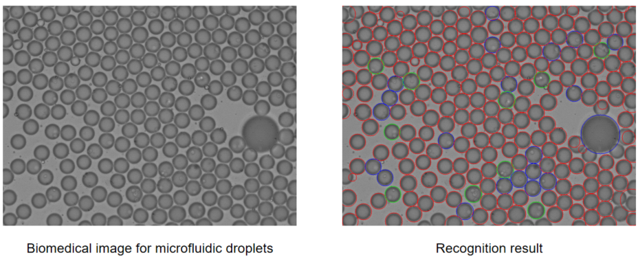

# WSCNet：一种包裹细胞的微流控液滴的生物医学图像识别算法

[English](README.md) | [简体中文](README.zh-CN.md)

# 项目简介

该代码是为微液滴显微图像设计的一种识别算法，能够有效地分析该图像中的液滴数量、尺寸，并确定每个液滴中包含的细胞数量，从而提供了一种自动分析微液滴包裹实验的方法，提高了微液滴生成实验的结果分析效率。

运行结果示例：



示例图片和其识别结果可以在[drop_counting/examples](https://github.com/Loyage/WSCNet/tree/master/drop_counting/examples)文件夹中找到。

# 代码运行

本代码使用了C++和Python两套编程语言，其中Python部分主要负责调用训练好的深度学习模型，实现对分割好的微液滴图像进行细胞计数，代码的主体部分用C++语言编写，包括对Python程序的调用。

运行该代码前，需要安装Anaconda/Miniconda。以下是Python运行环境的搭建方式：

```
conda create -n torch python=3.8
conda activate torch
pip install torch torchvision torchaudio --index-url https://download.pytorch.org/whl/cu117
pip install opencv-python
```

在C++部分，本代码提供了以下两种运行方式：

## 方式一：使用程序包直接运行代码

该方式的优点是用户无需对C++语言和其环境配置有太多了解，运行起来相对方便。

1.   [点击此处](https://github.com/Loyage/WSCNet/releases/download/v1.0.1/drop_counting-v1.0.1.zip)下载程序包，解压缩。

2.   如果你的图像是在暗场下采集的，运行`drop_counting_dark.exe`，否则运行`drop_counting_bright.exe`。接着输入需要处理的图像所在的目标文件夹地址。
3.   回车，等待结果。

## 方式二：重新编译源码运行

该方式要求用户安装Visual Studio，对C++有基本的了解，知道如何在VS中配置OpenCV环境。优点是可以在源码层面对代码做一定修改，对部分参数（如识别液滴的最小尺寸）进行自定义，这部分请参考[参数自定义](#参数自定义)。

1.   下载项目源码。

     ```
     git clone https://github.com/Loyage/WSCNet.git
     ```

2.   安装[Visual Studio](https://visualstudio.microsoft.com/vs/)，用其打开`drop_counting.sln`。

3.   下载[OpenCV – 4.7.0](https://opencv.org/releases/)并安装，安装路径建议设置为`F:\software\opencv`，否则在Visual Studio中将OpenCV相关的配置项修改为对应的新地址。

4.   在Visual Studio中点击开始执行，程序框出现后输入目标文件夹地址。
5.   回车，等待结果。

# 项目结构

```c++
├─drop_counting.sln //Visual Studio解决方案文件
├─drop_counting
│  ├─examples //示例图像及输出结果文件夹
│  ├─main.cpp
│  ├─dropProcessing.cpp
│  ├─dropProcessing.h
│  ├─droplet_forward.py //代码Python部分
│  └─drop_net-1.0.pt //训练所得神经网络模型参数
```

# 参数自定义

本项目针对不同环境提供了参数自定义功能，实验者可以根据具体情况调整部分参数，以达到最好的识别效果。

可调参数均放在了`main.cpp`文件的开头，参数的含义均已注释，如下：

```c++
bool is_bright_field = 0; //0-暗场图像，1-明场图像
string conda_env_name = "torch"; //使用的conda环境名称
const float min_radius = 8;  //识别液滴半径下限
const float max_radius = 80;  //识别液滴半径上限
const int kernel_size = 3;  //图像腐蚀、膨胀的核大小，图像清晰度较高时适当调整
bool findOverLap = 1; //是否检测重叠液滴
```

# 深度学习模型结构与训练方式

本代码使用到的深度学习模型属于CNN架构，模型具体参数可以在文件[drop_counting/droplet_forward.py](https://github.com/Loyage/WSCNet/tree/master/drop_counting/droplet_forward.py)中查看。

我们通过收集了大量微流控液滴生物医学图像数据，并使用弱监督的方式进行数据标注，最后用这些数据进行模型训练，最终得到代码中使用的网络模型参数。本项目公布了所有示例图像的数据标注结果，可以在[drop_counting/examples/manual_result](https://github.com/Loyage/WSCNet/tree/master/drop_counting/examples/manual_result)中查看和对比。

在训练过程中，我们将匹配响应阈值σ、小常数γ和权值ω分别设置为0.98、0.001和1。采用ReLU作为整个网络的激活函数。批量大小设置为1024。学习率初始化为$10^{-4}$，并根据验证集的损失进行调整。
